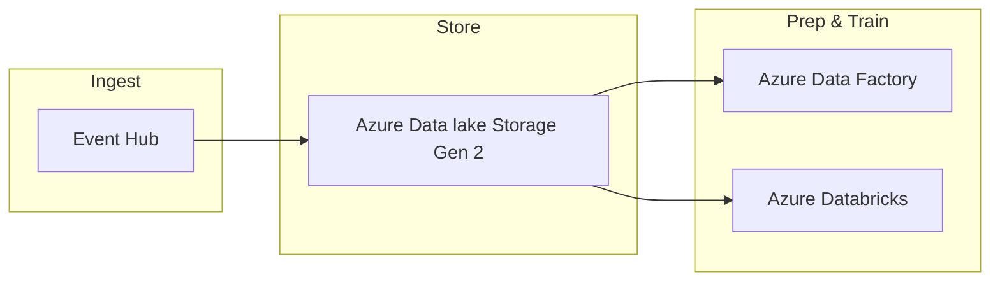

# terraform-azure
<!--  -->

```mermaid
  flowchart LR;
      subgraph Ingest
        A[Event Hub]
      end
      subgraph Store
        B[Azure Data lake Storage Gen 2]
        A-->B
      end
      subgraph Prep & Train
        C[Azure Data Factory]
        D[Azure Databricks]
        B-->C
        B-->D
      end
```